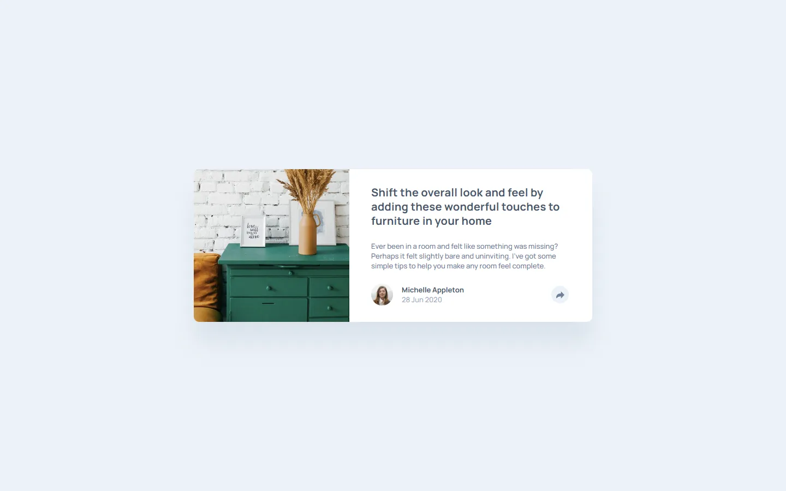
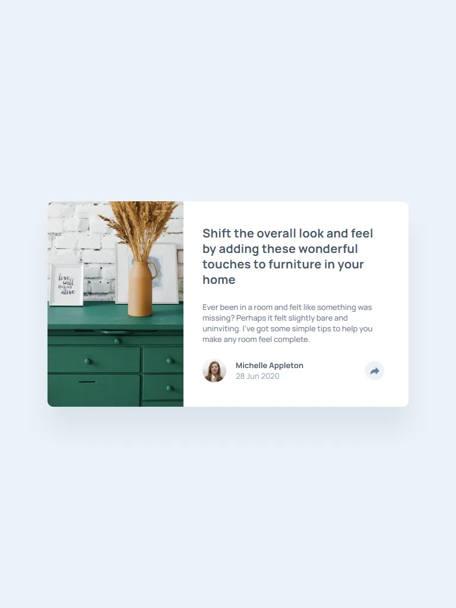
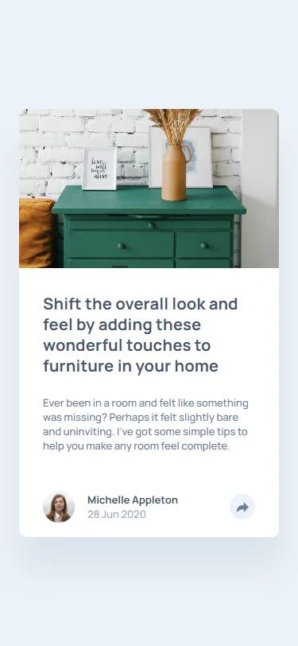

# Frontend Mentor - Article preview component solution

This is a solution to the [Article preview component challenge on Frontend Mentor](https://www.frontendmentor.io/challenges/article-preview-component-dYBN_pYFT). Frontend Mentor challenges help you improve your coding skills by building realistic projects.

## Screenshot

Desktop



Tablet



Mobile



## Links

- Solution URL: [https://www.frontendmentor.io/solutions/article-preview-component-using-sass-Fzyw-xUUUm](https://www.frontendmentor.io/solutions/article-preview-component-using-sass-Fzyw-xUUUm)
- Live Site URL: [https://nuzaty.github.io/fm-09-article-preview/](https://nuzaty.github.io/fm-09-article-preview/)

## My process

### Built with

- Semantic HTML5 markup
- Flexbox
- Mobile-first workflow
- Sass (Dart Sass)
- BEM
- JS

### CSS build

Install globally (one-time):

```
npm install -g sass
```

Dev:

```
sass --watch scss:dist
```

Build:

```
sass scss:dist
```
